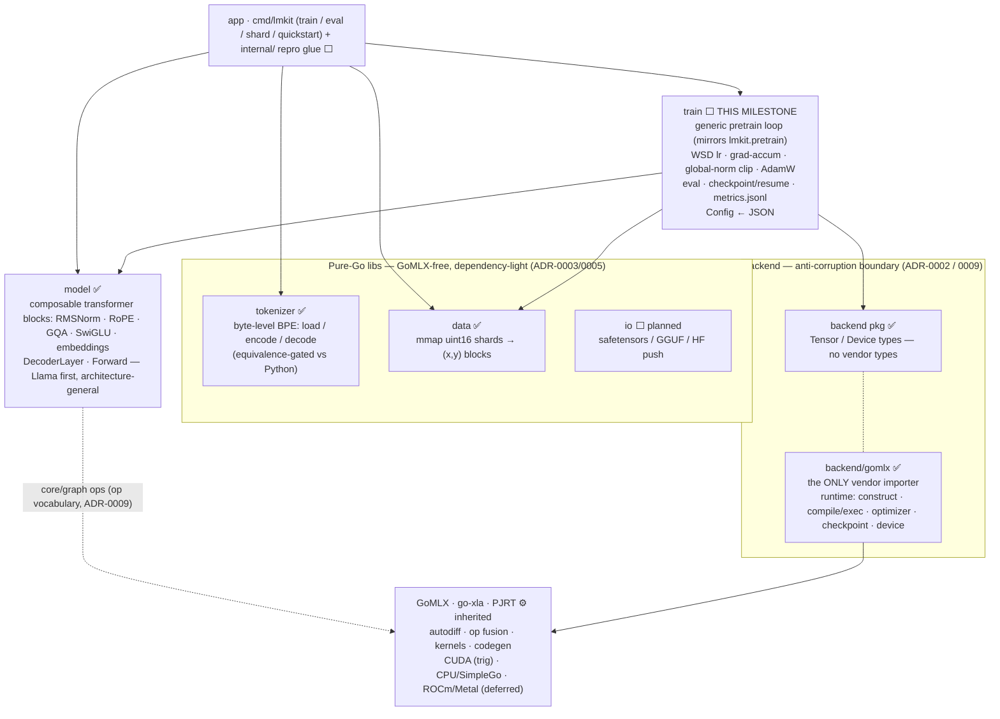

# lmkit-go — architecture

Status: ✅ built · ⬜ planned/next · ⚙️ inherited from the XLA backend.

## Module architecture (boundaries + dependencies)



The **boundary rule (ADR-0009):** only `backend/gomlx` imports the *runtime*
(`compute.New`, `go-xla`, plugins). `model`/`train` may use the GoMLX `core/graph`
*op vocabulary* but get execution/device/optimizer/checkpoint through `backend`.
`tokenizer`/`data`/`io` are pure-Go, GoMLX-free, independently reusable.

## Training-loop flow (the lm-100m pretrain run)

```mermaid
flowchart TB
  CFG["configs/lm-100m-en.json → train.Config"] --> RUN["train.Run(model, cfg, train/val loaders)"]
  SHARDS["train_*.bin / val_*.bin (raw uint16)"] --> DL["data.DataLoader → (x,y) int32 [B,T]"]
  DL -. feeds .-> ACC
  DL -. feeds .-> EVAL

  RUN --> RESUME{"latest.pt exists?"}
  RESUME -- yes --> LOADCK["restore model + optimizer + step + best_val"] --> STEP
  RESUME -- no --> STEP

  STEP{"step < max_steps?"}
  STEP -- no --> FINAL["save final + latest · emit done"]
  STEP -- yes --> LR["getLR(step): WSD warmup → stable → cosine tail (decay_frac=0 = pure stable)"]
  LR --> EVALQ{"step % eval_interval == 0?"}
  EVALQ -- yes --> EVAL["eval_iters val batches → val_loss, perplexity · save best if improved"] --> CKQ
  EVALQ -- no --> CKQ
  CKQ{"save / snapshot cadence?"} --> ACC

  ACC["grad-accum × grad_accum micro-batches<br/>Forward → CE loss / grad_accum → backward (accumulate grads)<br/>bf16 compute on CUDA · fp32 on CPU"]
  ACC --> NANQ{"loss finite?"}
  NANQ -- no --> EXIT2["save latest · exit 2 (resume from latest)"]
  NANQ -- yes --> CLIP["global-norm grad clip (1.0)"]
  CLIP --> OPT["AdamW step (wd on 2D+ params; β 0.9/0.95)"]
  OPT --> LOG["every log_interval → metrics.jsonl<br/>loss · lr · grad_norm · tok/s · tflops · peak_vram · tokens_seen"]
  LOG --> STEP

  SIG["SIGTERM / SIGINT"] -. clean .-> SAVEEXIT["save latest · exit 0"]
  CKQ -. latest/best/step_NNNNNN .-> OUT["checkpoints/ + metrics.jsonl → Grafana / ops CLI"]
  LOG -. .-> OUT
```

Mechanics mirror `lmkit.pretrain` + `lmkit.training` exactly; the loop is
hand-rolled (Go `for` + a compiled step graph) so eval/checkpoint/metrics/per-step
LR interleave and the global-norm clip (which GoMLX lacks) can be injected before
the AdamW step. The full lm-100m run is durable/resumable; the val curve toward
**1.7337** lands over days on `trig` (bf16 CUDA).
